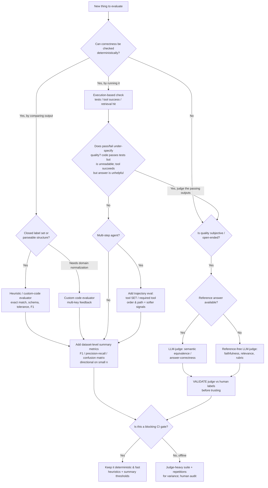

# Choosing an LLM Evaluation Strategy

This guide is the conceptual core of the repository. The code shows *how* to wire
evaluators into LangSmith; this document explains *which* evaluator to reach for, and
why. The central question it answers is the one most teams get wrong: **when is
LLM-as-judge actually the right tool, and when is it an expensive way to launder
non-determinism into your test suite?**

The short version: an evaluator is a measurement instrument. You pick it the way you
pick any instrument — by matching its precision, cost, and failure modes to what you
are trying to measure. Most production eval suites are *hybrids*, because most systems
have both deterministically-checkable constraints and irreducibly subjective quality.

---

## 1. A taxonomy of evaluation strategies

### (a) Heuristic / rule-based

Deterministic functions of the output (and usually a reference): exact match, regex,
JSON-schema validity, numeric tolerance, set overlap / token-F1, embedding cosine
similarity, and n-gram overlap metrics (BLEU, ROUGE).

- **When to use it.** There is a cheap, deterministic oracle for correctness: a closed
  label set, a parseable structure, a number with a known tolerance, a canonical set of
  expected tokens. This is the default — reach for it first and only escalate when it
  genuinely can't express what you mean.
- **Strengths.** Free, instant, perfectly reproducible, trivially debuggable, zero
  external dependency. Ideal CI gate material.
- **Weaknesses.** Brittle to surface variation. Exact match punishes a correct answer
  phrased differently. Regex rots. The deeper trap is the **semantic gap** in n-gram
  metrics: BLEU/ROUGE measure lexical overlap, not meaning. "The refund was approved"
  and "We've approved your refund" share few n-grams yet are equivalent; two factually
  opposite sentences can share many. They were designed for translation/summarization
  under reference sets and correlate weakly with human judgment of open-ended quality.
  Treat them as cheap sanity signals, never as quality verdicts.
- **Embedding similarity** is the strongest member of this family for semantics — cosine
  over sentence embeddings captures paraphrase far better than n-grams — but it differs in
  kind from exact-match and schema checks and deserves a sharper label than "deterministic."
  It is **reproducible given a pinned model**, not *deterministic* in the sense the rest of
  this family is: fastembed/ONNX cosine is stable run-to-run on the same machine, but the
  score is a function of the embedding-model version, the ONNX runtime/hardware, and
  quantization, and the accept/reject **threshold is a tuned hyperparameter, not an
  oracle**. So it carries *reproducibility* but not the *validity guarantee* that exact-match
  or `json.loads` carries — those are true oracles; this is a calibrated proxy. It is also
  still a blunt scalar: it cannot tell you *why* two texts differ, conflates topical
  similarity with correctness, and has no notion of factual contradiction (two opposite
  claims about the same topic score highly similar).
- **Cost/latency.** Effectively zero (embedding similarity adds one cheap local
  embedding call — in this repo, fastembed, no API).
- **Reliability.** Maximal *consistency* for exact rules; for embedding similarity,
  reproducible-but-tuned. Either way the open question is *validity* — does the rule
  measure what you care about?
- **Characteristic failures.** False negatives on correct-but-reworded outputs;
  false positives where surface form matches but meaning doesn't (n-gram); silent
  irrelevance when the metric drifts from the real objective.

### (b) Custom code / programmatic metrics

Bespoke Python that encodes domain logic a generic heuristic can't: normalize a date to
ISO-8601 before comparing, strip currency symbols and compare amounts within tolerance,
compute a weighted field-accuracy across a structured record, validate referential
constraints.

- **When to use it.** Correctness is deterministic but requires domain-specific
  normalization or composition before you can check it — classic for structured
  extraction.
- **Strengths.** Inherits everything good about heuristics (cheap, deterministic) while
  expressing real business rules. Can emit **multiple feedback keys from one evaluator**
  (e.g. `all_fields_present`, per-field match, aggregate `field_accuracy`), giving granular,
  debuggable signal.
- **Weaknesses.** You maintain it. Logic bugs in the evaluator masquerade as model
  regressions. Coverage is only as good as the cases you thought of.
- **Cost/latency.** Near zero. **Reliability.** As reliable as the code is correct —
  so unit-test your evaluators.
- **Characteristic failures.** Over-fitting the metric to current outputs; brittle
  normalization that breaks on an unseen-but-valid format.

### (c) Execution-based / functional checks

Don't judge the artifact — *run* it and observe. Did the generated code execute and pass
assertions? Did the tool call return success? Did the SQL parse and return rows? Did
retrieval surface the gold document at rank ≤ k?

- **When to use it.** There is a ground-truth *behavior* you can trigger. The gold
  standard whenever available — it sidesteps the semantic gap entirely by testing
  function, not form.
- **Strengths.** Objective, high-signal, hard to game. A passing test or a successful
  tool call is strong evidence.
- **Weaknesses.** Requires a runnable harness/sandbox and well-chosen checks. Pass/fail
  is coarse — it tells you *that* something failed, rarely *how well* a passing one did.
  Flaky environments produce flaky evals.
- **Cost/latency.** Depends on the harness — usually cheap relative to an LLM call.
- **Reliability.** High when the environment is hermetic.
- **Characteristic failures.** Environment flakiness read as model regression;
  under-specified checks that pass on subtly wrong behavior; the converse, over-strict
  checks that fail on acceptable variation.

### (d) Statistical & summary metrics

Aggregate row-level outcomes across the *dataset*: accuracy, precision, recall, macro-F1,
per-class breakdowns, confusion matrices (and, where the model emits confidence,
calibration — see the scope note below). In LangSmith these are **summary evaluators**,
which receive the full sequence of `(outputs, reference_outputs)` for the experiment and
emit one experiment-level score.

- **When to use it.** On top of row-level evaluators whenever the dataset has class
  structure and is large enough for the aggregate to be stable — you care about the
  *distribution* of errors, not any single row. A row-level pass rate hides the shape of
  failure. Caveat for this repo: several committed datasets are deliberately small, so
  per-class confusion cells can be n=1 and macro-F1 swings run-to-run; on small sets
  report these metrics but treat them as *directional* and lean on `num_repetitions` to
  estimate dispersion rather than reading a single point estimate.
- **Why they matter.** Mean accuracy is a liar on imbalanced data — 95% accuracy with a
  5%-prevalence positive class can mean you never detect the thing that matters.
  **Macro-F1** weights classes equally and exposes that. A **confusion matrix** tells you
  *which* classes collapse into each other — the single most actionable artifact for a
  classifier.
- **Calibration is named here as a concept, not a deliverable of this repo.** A
  reliability diagram / ECE asks whether a model's stated confidence matches its empirical
  hit rate — but it requires the model to emit a per-example confidence (a probability or
  logprob). The locked `classify` app is a single structured-output *label* call: it
  returns a class, not a calibrated probability, so there is nothing to calibrate and no
  reliability diagram is computed. Calibration would only enter scope if the classifier
  were changed to emit a confidence score; it is intentionally out of scope for the
  current single-label app and is **not** wired up alongside macro-F1 and the confusion
  matrix.
- **Strengths.** Turn raw outcomes into decisions; cheap (pure arithmetic over already-
  computed results); the natural unit for a regression gate ("macro-F1 must not drop
  below X").
- **Weaknesses.** Need enough examples to be stable; a summary number can still hide
  tail behavior. **Cost/latency.** Negligible. **Reliability.** High given sample size;
  only directional on the small datasets this repo commits.
- **Characteristic failures.** Reading a single aggregate without its dispersion;
  too-small datasets making metrics swing run-to-run.

### (e) LLM-as-judge

A capable model grades the output against a rubric — scoring faithfulness, relevance,
helpfulness, tone, or semantic equivalence — often with structured output. Covered in
depth in §2.

- **When to use it.** Quality is **subjective or open-ended** and there is **no cheap
  deterministic oracle**: summarization quality, answer faithfulness to context,
  semantic equivalence to a reference paraphrase, multi-criteria writing quality.
- **Strengths.** Handles nuance and open-endedness nothing else can; scales human-like
  judgment cheaply relative to actual humans; flexible via the rubric.
- **Weaknesses.** Biased, non-deterministic, poorly calibrated on absolute scores,
  costs tokens and latency, and **must itself be validated** against humans. See §2.
- **Cost/latency.** A full extra model call per row (often the most expensive judge).
- **Reliability.** Moderate and *conditional* on rubric quality, judge strength, and
  validation. Never assume it; measure it.
- **Characteristic failures.** Position/verbosity/self-preference bias, sycophancy,
  format sensitivity, score compression — §2.

### (f) Human evaluation

Expert review, annotation queues, pairwise preference labeling. In this repo, annotation
queues are created via the SDK and graded in the LangSmith UI.

- **When to use it.** The ground truth *is* human judgment (subjective quality, safety,
  domain expertise); to **build the reference set** that validates an automated judge;
  and as a periodic **audit** of automated evals in production.
- **Strengths.** The gold standard for subjective quality; the only way to *calibrate*
  and trust everything else.
- **Weaknesses.** Slow, expensive, doesn't scale, and has its own noise — inter-annotator
  disagreement, fatigue, drift, ambiguous guidelines. Humans need rubrics too.
- **Cost/latency.** Highest by far; hours-to-days, not seconds.
- **Reliability.** High *if* guidelines are clear and agreement is measured; otherwise
  deceptively noisy.
- **Characteristic failures.** Low inter-annotator agreement from vague rubrics;
  annotator bias; throughput bottleneck.

### (g) Process / trajectory evaluation (agents)

For multi-step agents, the final answer is not the whole story. Trajectory evaluation
inspects the **run tree**: the tool-call sequence, whether the right tool was selected,
whether arguments were well-formed, redundant or missing steps, and efficiency — not just
the terminal output.

- **When to use it.** Any agent where *how* it got the answer matters: a correct answer
  via a lucky wrong path is a latent bug, and a wrong answer with a sound trajectory is a
  different fix than a wrong answer with a broken one.
- **Strengths.** Diagnoses *where* in the chain things break; catches reward-hacking and
  brittle reasoning a final-answer check would pass.
- **What's actually robust to check.** For a small (2–3 tool) ReAct agent, exact reference
  tool *sequences* are usually non-unique and unstable — the same task has several valid
  orderings — so committing a gold sequence in `data.jsonl` and grading order-equality
  produces a brittle, frequently-wrong "correctness" signal. The demonstrable, robust
  heuristic is **tool-SET / tool-selection**: did the agent use the *required* tool(s) at
  all (set membership, order-insensitive), and did it avoid clearly-wrong tools? Order and
  efficiency (no redundant or missing steps) are *softer* signals, and "was this path
  reasonable?" is best left to an **optional judge** rather than an exact check.
- **Weaknesses.** Needs an expected-tool **set** (lightweight) or a path-reasonableness
  rubric; it does *not* warrant a committed gold path. Exact-sequence matching is too
  strict, which is exactly why this repo keys the heuristic off the tool set, not the order.
- **Cost/latency.** Heuristic set-membership checks are cheap; judge-based path grading
  costs a call.
- **Reliability.** High for tool-set / required-tool checks; moderate for judged
  reasonableness; *low* for exact-sequence matching, which is why it is avoided.
  **Characteristic failures.** Penalizing valid alternative paths when order is over-checked;
  rewarding right-answer-wrong-path when only the output is checked.

---

## 2. Deep dive: LLM-as-judge

LLM-as-judge is powerful and over-reached for in equal measure. Use it where it earns its
keep, know how it fails, and **always validate it**.

### When it is genuinely the right tool

- **Subjective / open-ended quality** with no closed reference: summary quality, draft
  helpfulness, tone, multi-criteria rubrics (a G-Eval-style scored rubric).
- **Semantic equivalence** where exact/n-gram match fails but meaning is checkable
  against a reference answer (answer-correctness).
- **Reference-free properties** that are functions of the input and output rather than a
  gold label: **faithfulness/groundedness** (is the answer entailed by the retrieved
  context?), **context-relevance**, instruction adherence.

If a cheap deterministic oracle exists, prefer it. A judge that re-derives "is this valid
JSON?" is strictly worse than `json.loads`.

### Well-documented failure modes

- **Position / order bias.** In pairwise grading, judges systematically favor the first
  (or last) candidate independent of content.
- **Verbosity bias.** Longer, more elaborate answers are rated higher even when not
  better.
- **Self-preference / self-enhancement bias.** A judge tends to prefer text generated by
  itself or its own model family — dangerous when judge and app share a model.
- **Sycophancy.** Agrees with assertions or framing embedded in the prompt; a confident
  wrong answer can be rated as good.
- **Reference anchoring (reference-based judges only).** When you hand the judge the gold
  answer — as in answer-correctness or semantic-equivalence grading — it tends to over-weight
  *surface* similarity to the reference wording: a correct answer phrased differently from
  the gold scores low, and a fluent answer that echoes the gold's phrasing scores high even
  when subtly wrong. The mitigation is to grade **semantic entailment in both directions**
  (does the answer entail the reference *and* the reference entail the answer?) rather than
  string/embedding similarity to the reference. The flip side: reference-*free* properties
  (faithfulness, relevance) have no gold to anchor on, but then drift onto the judge's own
  world knowledge — see below.
- **Format sensitivity.** Markdown, ordering, the presence of a "Final answer:" header,
  or trivial wording in the rubric can swing scores.
- **World-knowledge contamination (factuality judging).** On reference-free factuality, a
  judge grades against its own training knowledge, which is frozen at a cutoff and can be
  wrong or stale — so a *correct* answer about a recent event can be marked unfaithful, and
  a plausible-but-false claim the model also believes can be waved through. Constrain
  faithfulness judging to entailment *from the provided context* ("is this supported by the
  retrieved passages?") rather than "is this true in the world?", so the judge checks
  grounding, not its own memory.
- **Poor calibration of absolute scores.** Judges are bad at "rate this 1–10." Scores
  bunch in the middle, the scale isn't linear, and the same output scores differently on
  different days. **Relative/pairwise judgments tend to be more reliable than absolute
  ones** — the consistent finding behind preference-based leaderboards (the chatbot-arena
  / MT-bench line of work) — but pairwise is not free: it gives **no absolute score** to
  set a regression threshold against, scales **quadratically** in the number of candidates
  (O(n²) comparisons), and can yield **intransitive** rankings (A beats B, B beats C, C
  beats A). Use it to compare two prompt versions; keep an absolute heuristic for the CI
  bar.
- **Non-determinism / variance.** Same input, different score across runs — quantify it
  with repetitions, don't pretend it's zero.
- **Cost / latency.** A full model call per row; the most expensive evaluator to run at
  scale.

### Mitigations (concrete)

- **Structured rubric with explicit criteria.** Name each dimension, define what each
  score means. Vague prompts produce vague, unstable grades.
- **Reasoning before score (CoT).** Have the judge explain *then* emit the score; ordering
  rationale before the number measurably improves quality. Capture it in `comment`.
- **Prefer pairwise / relative over absolute Likert.** Ask "which is better, A or B?"
  instead of "rate 1–10." This sidesteps the calibration problem and is what
  `evaluate_comparative()` is for.
- **Randomize candidate order** to cancel position bias — `evaluate_comparative(...,
  randomize_order=True)`. For absolute grading, randomize/shuffle any in-prompt ordering.
- **Few-shot anchoring.** Include a couple of graded exemplars (a clear 1, a clear 5) to
  pin the scale.
- **Constrain output to a schema.** Structured Pydantic output (`with_structured_output`)
  forces a valid, parseable verdict and removes free-text drift — the pattern this repo
  uses for every judge.
- **Use a strong judge model, and split the judge family from the app family.** This is a
  concrete configuration step in this repo, not a platitude. The locked design points both
  the app-under-test (`APP_MODEL`) and the judge (`JUDGE_MODEL`) at the same
  provider-agnostic `init_chat_model` mechanism — and the shipped defaults
  (`APP_MODEL=anthropic:claude-haiku-4-5`, `JUDGE_MODEL=anthropic:claude-sonnet-4-6`) are
  **the same provider family**, which is *exactly* the self-preference failure mode
  described above. So the default is the bias, not the fix. **For any cross-evaluated
  scenario (rag, agent, generate), set `JUDGE_MODEL` to a different family than `APP_MODEL`
  — e.g. `APP_MODEL=anthropic:claude-haiku-4-5` with `JUDGE_MODEL=openai:gpt-4.1`, or
  vice versa.** The provider-agnostic knob is what makes that a one-line change; the
  recommendation here is to actually use it, and the repo documents the cross-family pair
  it evaluates with.
- **Ensemble across model *families* to touch bias; repetitions only cut variance.** These
  are two different tools and the distinction matters. Repeating the *same* judge model and
  taking majority/median reduces *random* variance, but a single model's *systematic*
  biases (position, verbosity, self-preference) are correlated across its own repetitions
  and **survive averaging** — repetition does not debias. Reducing systematic bias requires
  a **heterogeneous ensemble** (different model families voting) or explicit debiasing such
  as order randomization. Don't claim repetition-averaging removes bias; it removes noise.
- **VALIDATE THE JUDGE — the non-negotiable one.** Hand-label a sample, then measure
  agreement between judge and human (correlation / Cohen's κ / accuracy on the labeled
  set) and **report it**. An unvalidated judge is an opinion with a confidence interval
  you've chosen not to look at. Annotation queues (§1f) exist precisely to produce these
  human labels; re-audit periodically as prompts and models drift.

Honest bottom line: a *validated, pairwise, rubric-driven, schema-constrained,
order-randomized* judge is a genuinely useful instrument. A bare "rate this 1–10" prompt
is noise with good PR.

---

## 3. Hybrid approaches

Real suites combine strategies. The recurring idea: **let cheap, deterministic checks do
as much work as possible, and spend LLM-judge tokens only where they're irreplaceable.**

- **Cascade / layered (deterministic gate → judge).** Run cheap checks first; only invoke
  the judge if they pass. If extracted JSON is invalid, score 0 and never spend a judge
  call — garbage can't be "high quality." Saves cost and removes a class of judge noise.
  Its own failure mode: an **over-strict or buggy pre-gate becomes a silent quality
  censor** — it drops the judge on valid-but-unusual outputs, so you lose the quality
  signal precisely on the interesting tail and the offline picture skews optimistic.
  Monitor the gate's reject set (spot-check what it filtered) rather than trusting it
  blindly.
- **Heuristic pre-filter, judge the ambiguous tail.** Auto-pass clear wins and auto-fail
  clear losses heuristically; route only the gray zone (e.g. mid-range similarity) to the
  judge. Concentrates expensive judgment where it adds information.
- **Hard constraints + soft quality.** Deterministic checks enforce non-negotiables
  (valid schema, required fields, no banned content); a judge grades the soft remainder
  (helpfulness, tone). Composing both gives a verdict that is neither purely brittle nor
  purely fuzzy.
- **Ensemble with tie-break.** Combine a heuristic and a judge; on disagreement, escalate
  (third judge, or a human). Higher confidence than either alone.
- **Fast CI gate vs. rich offline analysis.** CI runs deterministic heuristics + summary
  metrics — fast, free, reproducible pass/fail. The slower judge-heavy suite runs offline
  / nightly for depth. Don't put a non-deterministic judge on the blocking path of every
  commit unless you've made it stable and cheap enough to belong there.
- **RAG is an inherent hybrid.** Retrieval is checked heuristically (recall@k against gold
  doc ids — deterministic), generation is checked by judges (faithfulness, context-
  relevance) plus reference-based answer-correctness. Neither half is sufficient alone:
  perfect retrieval with a hallucinated answer, or a faithful answer over the wrong
  context, are both failures only the *pair* of checks catches.
- **Human-in-the-loop calibration & audit.** Humans build the reference set that
  validates the judge, then periodically audit it. Automation scales; humans keep it
  honest.
- **Online sampling + automated eval + human spot-check.** In production, sample a
  fraction of live traffic, auto-run a judge on the sample, and route a thin slice to
  humans for spot-checking. Continuous coverage without grading every request.

---

## 4. Decision framework

In prose, walk these questions in order:

1. **Do you have ground truth, and is correctness deterministically checkable?** If you
   can *run* it (tests, tool, retrieval hit) — do that; it's the highest-signal, hardest-
   to-game option. If you can *compare* against a closed label or structure — heuristic or
   custom code. Exhaust this before anything stochastic. **But "it executes" is not "it's
   good":** execution checks are usually coarse pass/fail, and a passing output can still
   be low-quality (code passes tests but is unreadable; a tool call succeeds but the answer
   is unhelpful). When pass/fail under-specifies quality, route the *passing* outputs on to
   the subjective-quality question below — execution is a floor, not a verdict on quality.
2. **Is quality subjective / open-ended?** Only here does LLM-as-judge become the right
   default. Reference present → semantic-equivalence/correctness judge. Reference absent →
   reference-free judge (faithfulness, relevance, rubric). Then **validate it against
   humans** before you trust the numbers.
3. **Is this a CI gate or offline analysis?** CI must be fast and deterministic — lean on
   heuristics and summary-metric thresholds; keep flaky judges off the blocking path.
   Offline analysis can afford judge ensembles and repetitions for variance.
4. **What scale and budget?** High volume / tight budget pushes you toward cascades
   (cheap checks gate the judge) and sampling. Low volume / high stakes justifies humans
   and ensembles.
5. **Multi-step agent?** Add trajectory evaluation regardless of the above — final-answer
   checks alone hide process bugs. Key the robust heuristic off the **tool set / required
   tool** (order-insensitive), and treat order, efficiency, and path-reasonableness as
   softer signals (the last best handled by an optional judge), rather than committing a
   brittle gold tool *sequence*.

Almost every real answer is a *hybrid*: deterministic floor + judged ceiling + summary
metrics on top.

---

## 5. Summary comparison table

| Strategy | Needs ground truth | Deterministic | Handles subjective quality | Cost | Latency | Reliability | Good for CI | Typical use |
|---|---|---|---|---|---|---|---|---|
| Heuristic / rule-based | Usually | Yes | No | ~0 | ~0 | High (consistency) | Yes | Closed labels, schema validity, tolerances, F1 overlap |
| n-gram (BLEU/ROUGE) | Yes (refs) | Yes | Weakly | ~0 | ~0 | Low validity for semantics | Caution | Cheap lexical sanity signal only |
| Embedding similarity | Yes (ref text) | Reproducible w/ pinned model (not an oracle); threshold tuned | Partly | Low | Low | Medium | Yes (as proxy, not gate) | Paraphrase / topical similarity |
| Custom code / programmatic | Usually | Yes | No | ~0 | ~0 | High (if tested) | Yes | Domain-normalized structured extraction, multi-key feedback |
| Execution-based / functional | Behavioral | Yes | No | Low–med | Low–med | High (hermetic env) | Yes | Code runs, tool succeeds, retrieval hits gold doc |
| Statistical / summary metrics | Yes | Yes | No | ~0 | ~0 | High (w/ sample size); directional on small n | Yes | F1, accuracy, confusion matrix, regression thresholds (calibration only if the model emits confidence — out of scope for the single-label app) |
| LLM-as-judge | Optional | No | Yes | High | High | Moderate, conditional (validate!) | Caution | Subjective quality, semantic equivalence, faithfulness/relevance |
| Human evaluation | Defines it | No | Yes | Highest | Highest | High (clear rubric) | No | Calibrating judges, subjective/safety gold labels, audits |
| Trajectory: tool-selection | Expected tool **set** (lightweight; no gold path) | Yes | No | Low | Low | High | Yes | Did the agent use the required tool(s), order-insensitive |
| Trajectory: path-reasonableness | Rubric (no path) | No | Partly | Med | Med | Moderate (judged) | No | "Was this path sensible / non-redundant?" via judge |
| Agent final-answer | Reference answer | No | Yes | High | High | Moderate (validate!) | Caution | Terminal-output correctness, separate from the trajectory |

---

## 6. Where each strategy is demonstrated in this repo

The five scenarios were chosen so that, together, they exercise the whole taxonomy.
Evaluators live under `src/evals_showcase/evaluators/`; each scenario under
`src/evals_showcase/scenarios/<name>/` ships an `app.py`, `data.jsonl`, and
`experiment.py`.

All five scenarios and both cross-cutting pieces are committed and live; every
path referenced below exists in the repo.

| Strategy | Where it's demonstrated | Status |
|---|---|---|
| Heuristic exact-match | **classify** — `evaluators/heuristic.py`, exact-match on the label against a closed intent set. | Live |
| Statistical / summary metrics | **classify** — `evaluators/summary.py`: accuracy, macro-F1, per-class precision/recall as LangSmith **summary evaluators**; `num_repetitions` drives variance reporting. (No calibration — the single-label app emits no confidence; see §1d.) | Live |
| Custom code / multi-key programmatic | **extract** — one CODE evaluator emits `all_fields_present`, per-field normalized match, numeric tolerance, and aggregate `field_accuracy` (the `list[dict]` → multiple-feedback pattern). | Live |
| Execution-based / functional (retrieval hit) | **rag** — heuristic **recall@k** over committed corpus doc ids (fastembed, cosine). **agent** — tool-call success as a functional check. | Live |
| LLM-as-judge (reference-free) | **rag** — faithfulness/groundedness and context-relevance judges (`evaluators/judges.py`), structured Pydantic grades over the retrieved context. **Set `JUDGE_MODEL` to a different provider family than `APP_MODEL`** (see §2). | Live |
| LLM-as-judge (reference-based) | **rag** — answer-correctness vs. reference (graded as two-way entailment, not string similarity; see §2). **agent** — final-answer judge. | Live |
| Trajectory / process eval | **agent** — `evaluators/trajectory.py`: order-insensitive **tool-set / required-tool** selection over the LangGraph run tree (the robust heuristic), with path-reasonableness left to an optional judge — *not* a committed gold tool sequence. | Live |
| Pairwise / relative judge | **generate** — `evaluate_comparative()` across two Prompt Hub prompt versions, `randomize_order=True` to debias position. | Live |
| Reference-free rubric judge (multi-criteria) | **generate** — G-Eval-style categorical + continuous rubric feedback. | Live |
| Human evaluation | **cross-cutting** — `annotation.py` creates an annotation queue via the SDK and enqueues sampled runs; grading happens in the LangSmith UI (used to validate judges). | Live |
| Online / production eval | **cross-cutting** — `online.py` traffic simulator emits `@traceable` runs to a project; an online evaluator / automation rule is configured in the LangSmith UI (click-path documented in `docs/`). | Live |
| CI regression gate | **cross-cutting** — `tests/` with a custom `@pytest.mark.live` marker plus pure-unit evaluator tests, wired into GitHub Actions: deterministic heuristics + summary thresholds gate every commit. | Live |

The design principle threading all of it: **deterministic checks form the floor, judges
add the ceiling, summary metrics turn rows into decisions, and humans keep the judges
honest.** That layering — not any single evaluator — is the actual skill.

> Off-the-shelf alternative: prebuilt judge/evaluator libraries such as **openevals**
> offer ready-made graders. This repo deliberately builds **custom** judges
> (`init_chat_model` + structured Pydantic output) to make the rubric, bias mitigations,
> and validation explicit rather than hidden behind a helper — openevals is named here as
> a valid alternative, not a dependency.
